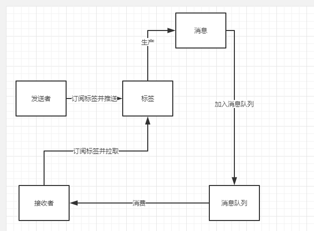

# notify-design

# 消息生产消费流程

# 消息总览

### 消息生产者
* 系统
* 消息发送者

### 消息消费者
* user

### 标签
* 标签(全局消息,销售系统A,销售系统B)

### 订阅
* 生产者订阅
* 消费者订阅

### 消息
* 公告 Announce
* 提醒消息 Message

# 行为

### 生产者
* 订阅标签
* 生产消息
* 推送到消息队列

### 消费者
* 订阅标签
* 消费消息队列
    * 拉取
    * 阅读
    * 查询

#表设计
### 标签表(notify_tag)
| id | name | created_at | updated_at| 
| --- | ---  | --- | --- |
| ID | 标签名 |创建时间|更新时间|

### 消息表(notify)
| id | content | type | sender | created_at | updated_at| 
| --- | --- | --- | --- | --- | --- |
| ID | 消息内容 | 消息类型(1.公告,2.提醒)|发送者|创建时间|更新时间|

### 消息表(tag_notify_map)
| id | tag_id |notify_id | created_at | updated_at| 
| --- | ---  | --- |--- | --- |
| ID | 标签ID |消息ID|创建时间|更新时间|

### 标签订阅表(tag_subscription)
| id | role_type |tag_id | created_at | updated_at| 
| --- | ---  | --- |--- | --- |
| ID | 1.生产者,2.消费者 |标签ID|创建时间|更新时间|

### 用户消息表(user_notify)
